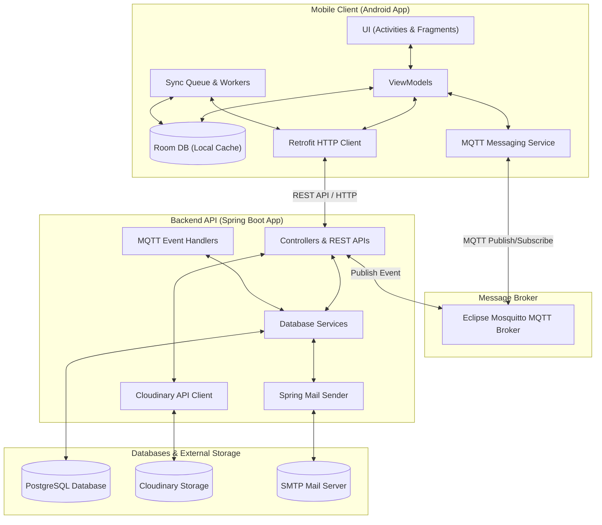

# Real-Time Messenger Application

[]()
[]()
[]()
[]()
[]()
[]()

A cross-platform real-time instant messaging application built with a robust Spring Boot backend, a real-time Eclipse Mosquitto MQTT broker, and an offline-first Android mobile client.

---

## 📖 Table of Contents
1. [Overview](#-overview)
2. [Key Features](#-key-features)
3. [System Architecture](#-system-architecture)
4. [Technology Stack](#-technology-stack)
5. [Directory Layout](#-directory-layout)
6. [Quick Start Guides](#-quick-start-guides)

---

## 🌟 Overview

This project is a modern chat application that implements high-performance messaging with strict offline reliability. The architecture is designed to support:
- **Instant message transmission** with low-overhead MQTT packet transfers.
- **Robust offline experience** where all actions (sending messages, status updates) are logged into a local database and synchronized automatically once network connection is restored.
- **Rich media and signaling** support for file/image transfer and audio/video calling.

---

## ✨ Key Features

### 💬 Real-Time Messaging & Presence
- Instant messaging between users (1-to-1) and groups.
- Message delivery indicators: `Sending` ➡️ `Sent` ➡️ `Delivered` ➡️ `Read`.
- User online presence tracking and "Last seen at..." status.

### 📶 Offline-First Capabilities (Sync Queue)
- Full messaging functionality when completely offline.
- Messages are saved directly to Room DB with a `PENDING` sync state.
- A local **Sync Queue** logs unsent payloads and automatically publishes them to the server once the device goes back online.
- Null-safe UI adapter bindings prevent rendering failures during offline transitions.

### 📞 Call Signaling Integration
- REST APIs designed for establishing, answering, rejecting, and terminating voice and video calls.
- WebRTC signaling data exchange endpoint support to establish peer-to-peer media paths.

### 📁 Media Sharing & Utilities
- Upload attachments, images, and files inside chat rooms.
- Server integration with **Cloudinary** for image caching and media streaming optimization.
- Email verification support via SMTP.

---

## 🏗️ System Architecture

The following diagram illustrates the interaction flow between the Android application, the Spring Boot API, the PostgreSQL database, and the Mosquitto MQTT message broker:



---

## 🛠️ Technology Stack

| Component | Technology | Version | Description |
| :--- | :--- | :--- | :--- |
| **Backend API** | Spring Boot | `3.x` | Core backend container, security context & REST endpoints |
| **Database** | PostgreSQL | `15` | Relational storage for user accounts, credentials, and persistent messages |
| **MQTT Broker** | Eclipse Mosquitto | `2.x` | Real-time message exchange and topic subscription routing |
| **Client Core** | Native Android | Java | MVVM clean architecture client |
| **Client DB** | Room DB | `2.6.x` | Local cache SQL database layer for offline capability |
| **Networking** | Retrofit & OkHttp | `2.9.x` | REST API communication, token interceptors, and logging |
| **Realtime Sync** | Paho MQTT client | `1.2.5` | Handles publish/subscribe connection from the mobile app |
| **Image Loading** | Glide | `4.16` | Asynchronous image loading, resizing, and memory caching |

---

## 📁 Directory Layout

```
messenger-develop/
├── backend-api/               # Backend codebase and configurations
│   ├── docker-compose.yml     # Docker architecture orchestrator
│   ├── .env.example           # Environment template file
│   └── messenger/             # Spring Boot Maven Project
│
├── android-app/               # Android client codebase
│   ├── app/                   # Mobile application source modules
│   └── build.gradle.kts       # Gradle project settings
│
└── README.md                  # This file
```

---

## 🚀 Quick Start Guides

To run and configure different components of the application, please head over to their respective folders and read the guides:

*   💻 **Backend Server Guide:** [backend-api/README.md](file:///e:/mobile_project/backend-api/README.md) – Step-by-step setup for running the Spring Boot API, PostgreSQL, and MQTT Broker locally or inside Docker.
*   📱 **Android Mobile App Guide:** [android-app/README.md](file:///e:/mobile_project/android-app/README.md) – Configuration steps to build the APK, configure host connection IPs, and run the app.
